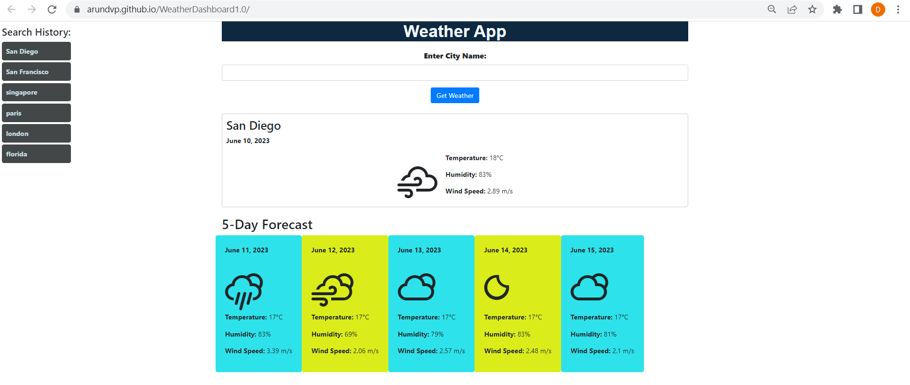

# WeatherDashboard1.0

## Objective:

Build a weather dashboard that will run in the browser and feature dynamically updated HTML and CSS. Use the 5 Day Weather Forecast to retrieve weather data for cities.

## User Story: 

AS A traveler
I WANT to see the weather outlook for multiple cities
SO THAT I can plan a trip accordingly

## Summary of the Code 

This code sets up a weather application that allows users to search for weather information for a specific city. Here's a summary of what the code does:

1. It defines a global variable `API_KEY` that holds an API key for accessing the OpenWeatherMap API.
2. It adds an event listener to the form submission of `weatherForm` (presumably a form element in the HTML).
3. When the form is submitted, it prevents the default form submission behavior, retrieves the city name input by the user, and calls the `getWeather` function with the city name.
4. The `getWeather` function constructs the API URL with the provided city name, API key, and desired units (metric) and makes an HTTP GET request using the Axios library.
5. Upon receiving a successful response from the API, the `displayWeather` function is called with the returned data.
6. The `displayWeather` function extracts relevant weather data from the API response and dynamically generates HTML to display the current weather conditions and a 5-day forecast.
7. The `getWeatherIconClass` function maps the OpenWeatherMap icon codes to corresponding weather icon classes.
8. The `saveSearchHistory` function saves the searched city name to the browser's localStorage, maintaining a history of the last 5 searches.
9. The `displaySearchHistory` function retrieves the search history from localStorage and dynamically generates HTML to display the search history as clickable items.
10. The `displaySearchHistory` function is called to display the search history on page load.

In summary, this code sets up a weather application with a search form, retrieves weather data from the OpenWeatherMap API, displays the current weather conditions and a 5-day forecast, and keeps a history of the user's past searches.

## Tasks Completed: 

Created the GIT repository named WeatherDashboard1.0

Pushed the code the repository WeatherDashboard1.0

Hosted the index.html in GitHub Pages

## Links

URL to my deployed webpage: https://arundvp.github.io/WeatherDashboard1.0/
URL to the GitHub repository: https://github.com/arundvp/WeatherDashboard1.0

